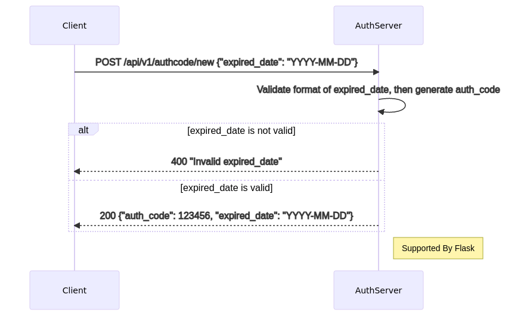
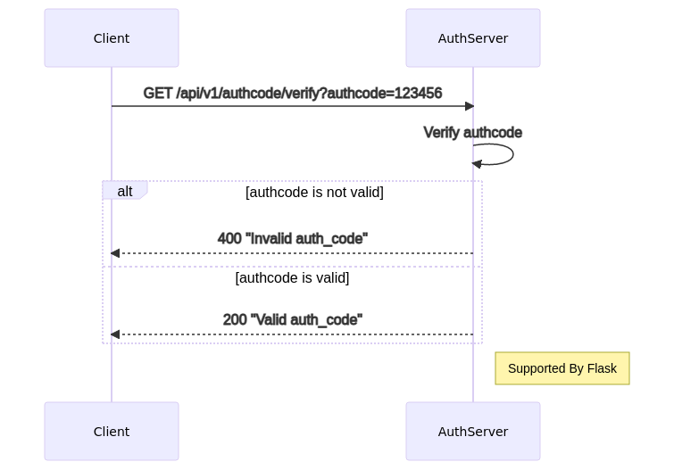

# simple-auth-server

We use a very simple implementation to generate auth-code and verify it. 

* auth-code generate-procedure

```text
auth_code = 6_num_random_generator()
IF auth_code has been created before, we should regenerate it.
salt = 8_num_random_generator()
# both today and expired_date present as YYYY-MM-DD
datetime_range_array = datetime_range_generator(today, expired_date)
auth_code_hash_array = []
FOR date IN datetime_range_array
  auth_code_hash = SHA256(auth_code + "_" + salt + "_" + date)
  auth_code_hash_array.Append(auth_code_hash)
persist db = {auth_code: {"salt": salt, "hash_list": auth_code_hash_array}} into persistent file
return auth_code
```

* auth-code verify-procedure

```text
auth_code is from user's request
read from persistent file as db
salt = db[auth_code]["salt"]
# today presents as YYYY-MM-DD
auth_code_hash = SHA256(auth_code + "_" + salt + "_" + today)
auth_code_hash_array = db[auth_code]["hash_list"]
IF auth_code_hash IN auth_code_hash_array THEN
  return valid
ELSE
  return invalid
``` 

## Get Started

### Prerequisites

```text
1. debian/ubuntu/centos linux/x86-64 release
2. python 3.7 linux/amd64 or higher
```

### Installation

#### Clone

* Clone this repo to your local machine using https://github.com/amazingchow/simple-auth-server.git.

#### Setup

```shell
# for debug/dev
make run_server_local

# for prod
make run_serverd
```

### Api List

1. generate a new auth code



```shell
curl -X POST -H 'content-type: application/json' -d '{"expired_date": "2022-02-25"}' "http://127.0.0.1:15555/api/v1/authcode/new"

{
  "auth_code": "866790", 
  "expired_date": "2022-02-25"
}
```

2. verify the auth code



```shell
curl -I "http://127.0.0.1:15555/api/v1/authcode/verify?authcode=866790"
```

## Contributing

### Step 1

* 🍴 Fork this repo!

### Step 2

* 🔨 HACK AWAY!

### Step 3

* 🔃 Create a new PR using https://github.com/amazingchow/simple-auth-server/compare!

## Support

* Reach out to me at <jianzhou42@163.com>.

## License

* This project is licensed under the MIT License - see the **[MIT license](http://opensource.org/licenses/mit-license.php)** for details.
